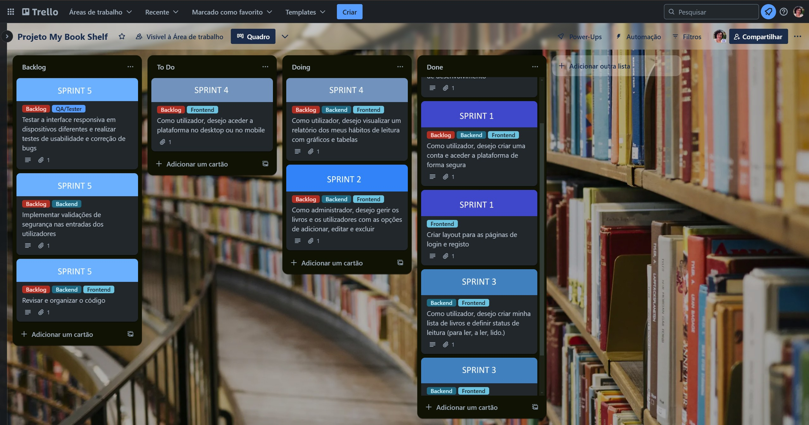
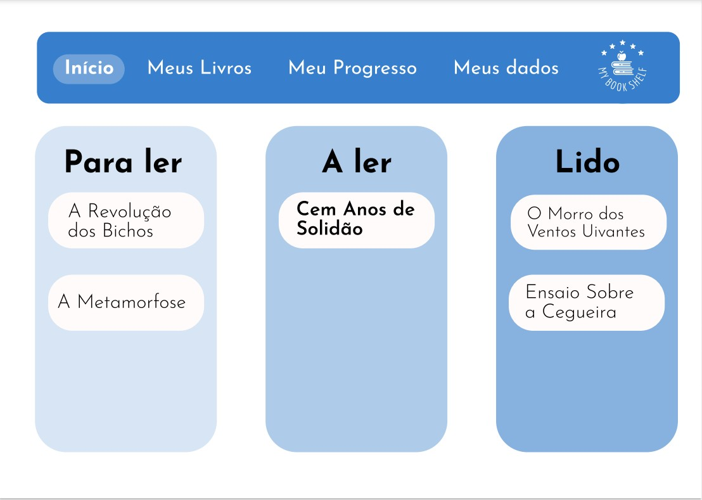
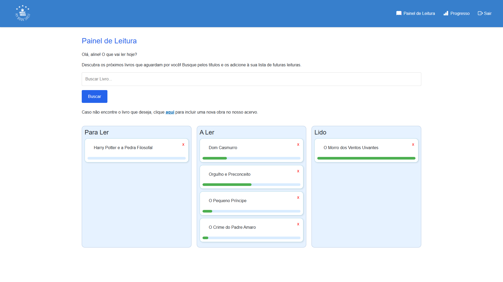
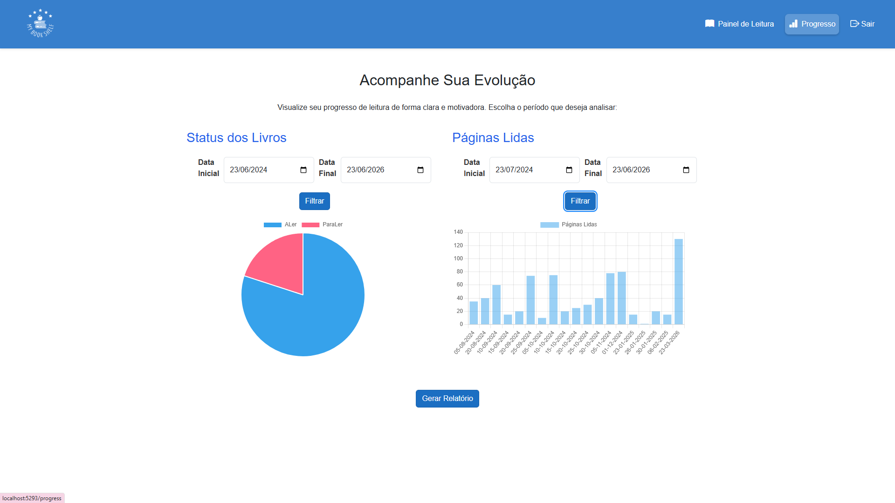

# My Book Shelf — Reading Habit Tracker

A web application designed to help users build and maintain a consistent reading habit — making progress visible, reducing friction, and increasing motivation over time.

Developed as part of a Technical Specialist programme in Information Systems Programming.

---

## The Problem

Less than 50% of the Portuguese population reads at least one book per year. The core issue isn't lack of interest — it's lack of continuity.

My Book Shelf was built to address this: a simple, focused tool that makes reading progress visible and reinforces consistency over time.

---

## Product Approach

**Discovery & framing**
The product was framed around three key drivers: visibility of progress, sense of achievement, and ease of tracking. Rather than building a feature-rich reading app, the focus was kept on the core habit-building loop.

**Planning**
The project was structured using Scrum across five two-week sprints, with a prioritised product backlog, effort estimation, sprint scope definition, and risk mapping (timeline, technical complexity, and continuity risks).

**Design**
A Figma prototype was created before development to validate user flows and ensure alignment between functionality and experience. The system architecture follows a three-layer model: presentation, business logic, and data.

---

## Core Features

- Book tracking with status management (To Read, Reading, Read)
- Reading progress tracking by pages and dates
- Data visualisation through habit charts
- Admin panel for content management

---

## Outcome

A functional full-stack product that enables users to track reading progress and visualise habits over time.

Final grade: **19/20** — with positive feedback on problem framing and product approach.

---

## Stack

C# · Blazor Web App · SQL Server · Entity Framework Core · Bootstrap · Figma · Trello · GitHub
